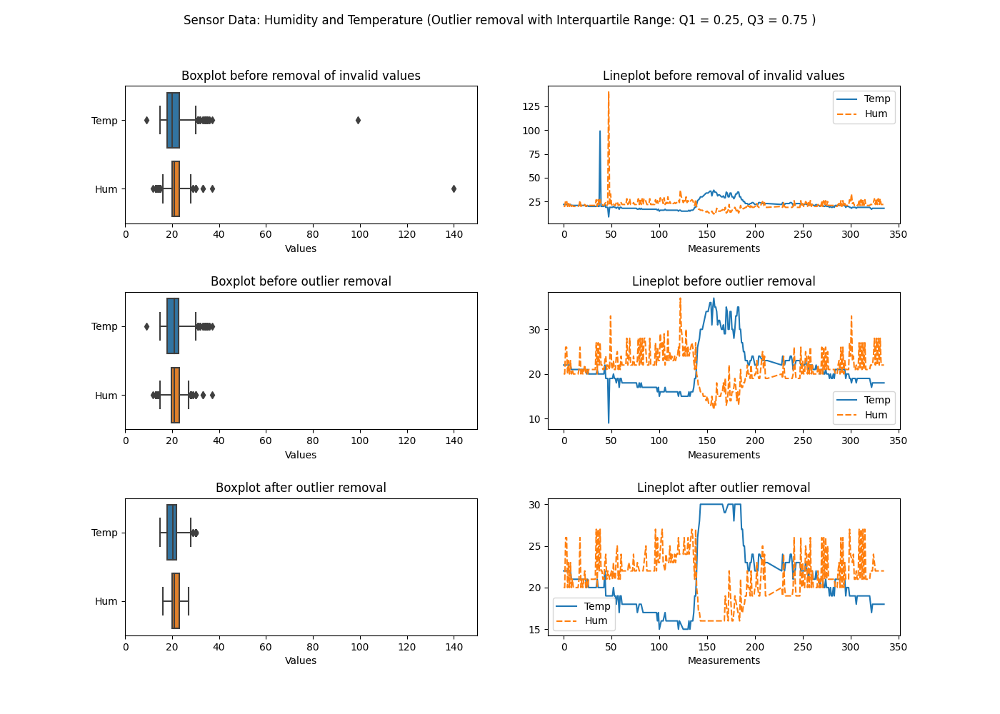
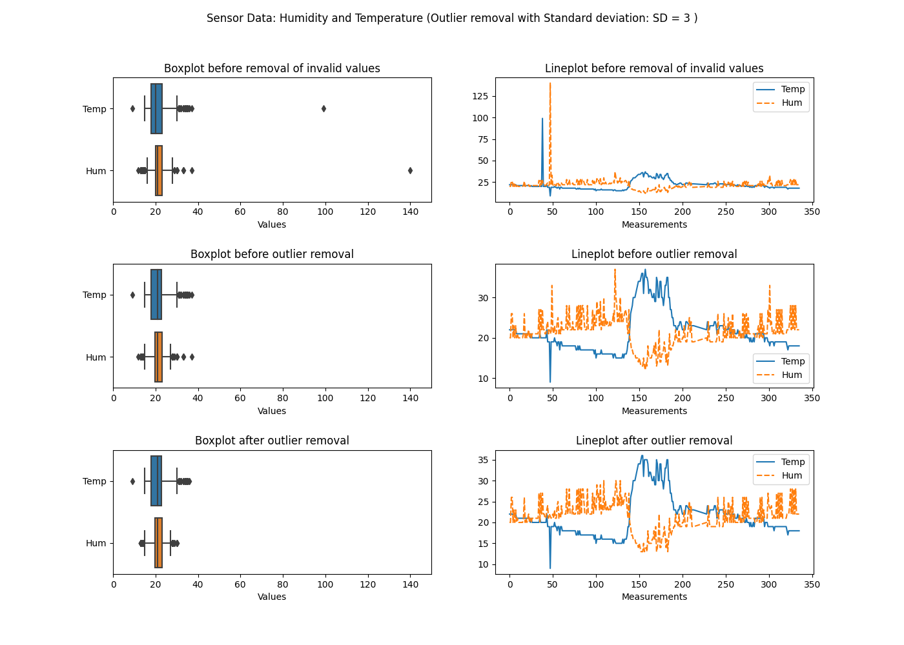
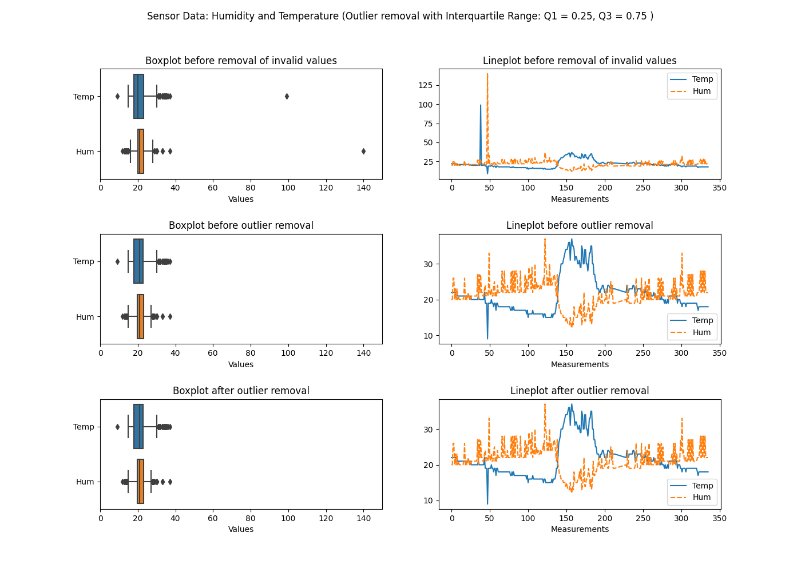

# SDA-CaseStudy-TimeSeries

**Link to GitHub Repository:**
[https://github.com/JiriD85/SDA-CaseStudy-TimeSeries](https://github.com/JiriD85/SDA-CaseStudy-TimeSeries)

## 1. Usage of TimeSeriesHandler.py
```
usage: TimeSeriesHandler.py [-h] -i <filename> -o <filename> [-p] (-iq | -st | -no) -u <choice> [-z <s>] [-l]

optional arguments:
  -h, --help            show this help message and exit
  -i <filename>, --input <filename>
                        Specify the path to the input-file
  -o <filename>, --output <filename>
                        Specify the path to the output-file
  -p, --plot            Show Plot (default: disabled)
  -iq, --iqr            Use IQR for outlier identification (default: disabled)
  -st, --std            Use Z-Score for outlier identification (default: disabled)
  -no, --noremoval      No outlier removal (default: disabled)
  -u <choice>, --outlier <choice>
                        Choose outlier replacement method. Choices: [remove, mean, median, limit, mode, ignore]
  -z <s>, --zscore <s>  Z-Score for outlier detection (default: 3)
  -l, --log             Show detailed logs (default: disabled)
```

## 2. Examples
### 2.1. Outlier removal with Interquartile range
Example how to start TimeSeriesHandler.py with Input-file `--input <input.log>`, Output-file `--output output.log`, deactivated plot (plot.png will be saved in the same directory), activated Interquartile range `--iqr -u remove` for outlier removal:
```
python.exe TimeSeriesHandler.py --input input.log --output output.log --iqr -u remove
```

**Plot of the Example with Outlier removal using Interquartile range**:



Part of the content of `input.log`:
```
1022-09-14 19:33:07 T=22.0 H=20.0 TO=45
1022-09-14 19:38:10 T=22.0 H=20.0 TO=45
1022-09-14 19:43:11 T=22.0 H=26.0 TO=45
2022-09-14 19:48:14 T=22.0 H=26.0 TO=45
2022-09-14 19:53:15 T=22.0 H=20.0 TO=45
2022-09-14 19:58:15 T=22.0 H=23.0 TO=45
```

Part of the content of `output.log`
```
Temp,Hum,Datetime
22.0,20.0,2022-09-14 19:33:15
22.0,20.0,2022-09-14 19:38:15
22.0,26.0,2022-09-14 19:43:15
22.0,26.0,2022-09-14 19:48:15
22.0,20.0,2022-09-14 19:53:15
22.0,23.0,2022-09-14 19:58:15
```

### 2.2. Outlier removal using Standard deviation with Z-Score = 3
Example how to start TimeSeriesHandler.py with Input-file `-i input.log`, Output-file `-o output.log`, deactivated plot (plot.png will also be saved in the same directory), activated Standard deviation with 3 Standard deviations `-st -z 3`, outlier replacement method `-u limit` and detailed logs `-l`:
```
python.exe TimeSeriesHandler.py -i input.log -o output.log -st -z 3 -l -u limit
```

**Plot of the Example with Outlier removal using Standard deviation**:


### 2.3. No Outlier removal/replacement
Example how to start TimeSeriesHandler.py with Input-file `-i input.log`, Output-file `-o output.log`, activated plot `-p` (plot.png will also be saved in the same directory):
```
python.exe TimeSeriesHandler.py -i input.log -o output.log -p -no -u ignore
```
**Plot of the Example without outlier removal**:



## 3. Overview Methods
1. 	**open_file():** Creates Dataframe from the csv- or log-file in the specified path.
2.  **rename_columns():** Renames the columns in the dataframe.
3.  **create_datetime():** Creates pandas Datetime in new column. Drops columns Date and Time.
4.  **get_first_valid_timestamp():** Gets the first valid timestamp of the Dataframe.
5.  **get_last_valid_timestamp():** Gets the last valid timestamp of the Dataframe.
6.  **calculate_mean_timegap():** Calculates the mean timegap between timestamps.
7.  **check_valid_date():** Checks if dates are valid. Changes invalid dates to NaT.
8.  **replace_nat():** Checks the dataframe for NaT. Replaces all NaT / invalid timestamps. Uses the mean timegap for calculations.
9.  **format_data_columns():** Replacing Strings in Temp and Hum. Drops column TO. Converts values to float. Replaces empty string with np.nan. Creates NaN Index.
10. **check_valid_value():** Checks if the values of Temp and Hum are in a valid range. Invalid values are replaced with NaN.
11. **interpolate_nan():** Interpolates NaN values of Temp and Hum.
12. **remove_outliers():** Identifies and removes/replaces outliers. Works for Standard deviation (Z-Score) and for Interquatrile Range. Choices for replacement are: [remove, mean, median, limit, mode, ignore]
13. **drop_duplicates():** Drops identical duplicates of data in dataframe.
14. **plot_data():** Creates Boxplots and Lineplots for Time series Temp and Hum. For a better data comparison two dataframes are compared to each other (before and after outlier removal).
15. **export_file():** Exports Dateframe to File in the specified path.

## 4. Statistical Background: IQR, SD and Z-Score

Boxplot (with an interquartile range) and a probability density function (pdf) of a Normal N(0,σ2) Population:


### 4.1. Interquartile Range
In descriptive statistics, the interquartile range (IQR) is a measure of statistical dispersion, which is the spread of the data. It is defined as the difference between the 75th and 25th percentiles of the data. These quartiles are denoted by Q1 (also called the lower quartile), Q2 (the median), and Q3 (also called the upper quartile). The lower quartile corresponds with the 25th percentile and the upper quartile corresponds with the 75th percentile, so IQR = Q3 −  Q1. Following steps have to be followed:

- Find the first quartile, `Q1`.
- Find the third quartile, `Q3`.
- Calculate the IQR. `IQR = Q3 - Q1`.
- Define the normal data range with lower limit as `Q1 – 1.5 * IQR` and upper limit as `Q3 + 1.5 * IQR`.
- Any data point outside this range is considered as outlier and should be removed for further analysis.
- In boxplot, this IQR method is implemented to detect any extreme data points where the maximum point (the end of high whisker) is `Q3 + 1.5 * IQR` and the minimum point (the start of low whisker) is `Q1 – 1.5 * IQR`.

### 4.2. Standard deviation
Standard deviation method is similar to IQR procedure. Depending on the set limit either at 2 times stdev or 3 times stdev, we can detect and remove outliers from the dataset. 

$$ Upperlimit = { mean + 3 * stdev } $$

$$ Lowerlimit = { mean - 3 * stdev } $$

Z-score is used to convert the data into another dataset with mean = 0.
Here, $\bar x$ is the mean value and $s$ is standard deviation. Once the data is converted, the center becomes 0 and the z-score corresponding to each data point represents the distance from the center in terms of standard deviation. For example, a z-score of 2.5 indicates that the data point is 2.5 standard deviation away from the mean. Usually z-score = 3 is considered as a cut-off value to set the limit. Therefore, any z-score greater than +3 or less than -3 is considered as outlier which is pretty much similar to standard deviation method:

$$ Z = {x_{i} - \bar x \over s} $$